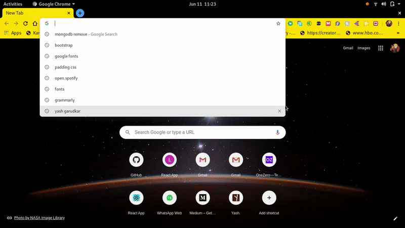

# MERN Stack GraphQL App

A simple MERN app with Express and GraphQL middleware.



>Install dependencies in both folders:
1. server
2. client
>Run server first
>In server folder
```
npm run dev
```
>In client folder
```
npm start
```